# 🎓 EduTrack - Full Stack Education Management System

EduTrack is  built with **Node.js**, **Express.js**, **MySQL**, **React** and **Tailwindcss. It allows administrators to manage students, courses, teachers, and enrollments with a modern and responsive UI. Designed for educational institutions to streamline academic data management.

---

## 🚀 Features

- 🏠 **Homepage** with quick navigation
- 🎓 Manage **students** with add/edit/delete/details functionality
- 📚 Manage **courses** with assigned teachers
- 👩‍🏫 Manage **teachers** with subject expertise
- 📝 Enroll students into courses
- 🔎 View enrollment details and statuses
- 📊 Admin Dashboard with stats and actions
- 💻 Fully responsive frontend using React + Tailwind CSS

---

## 📸 Screenshots


---
 
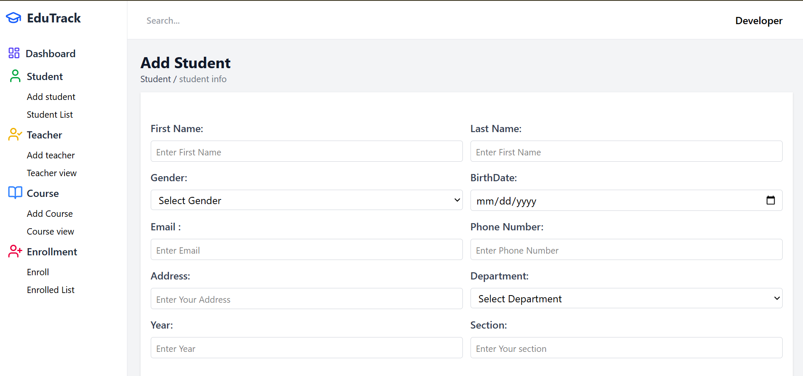

---
 
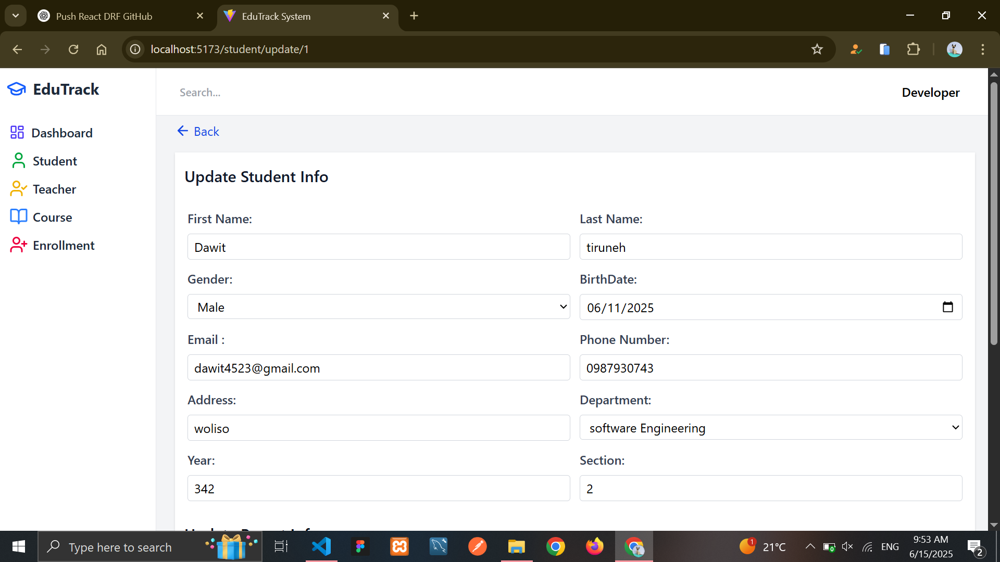

---
 


---
 


---


---


---
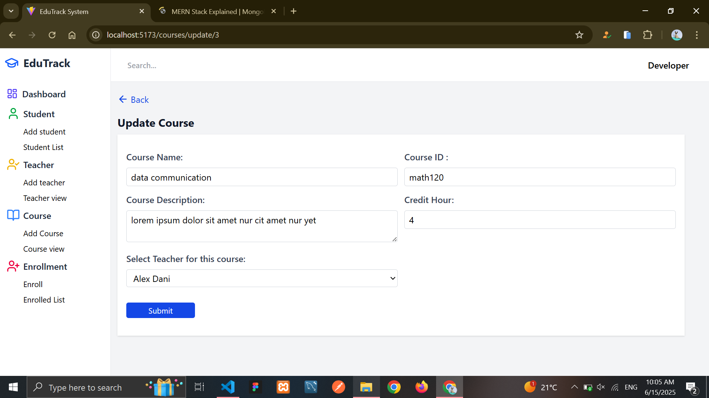

---
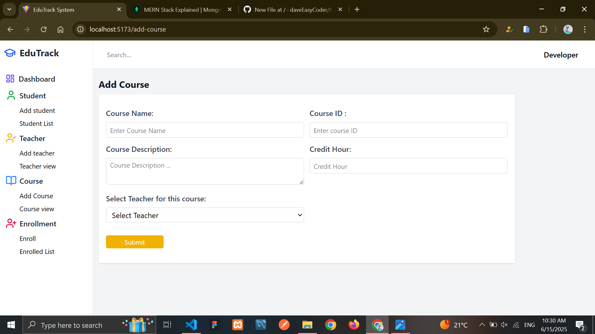

---
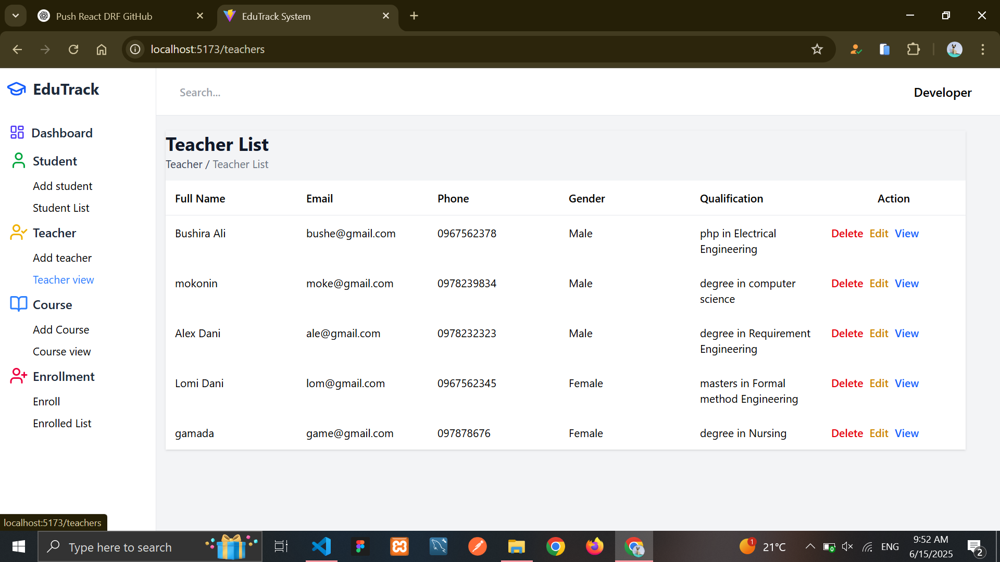

---
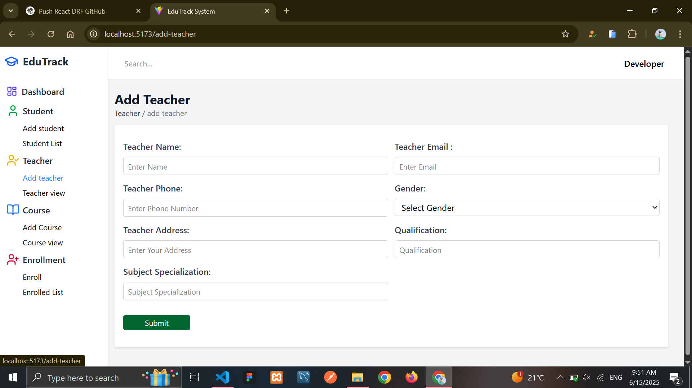

---
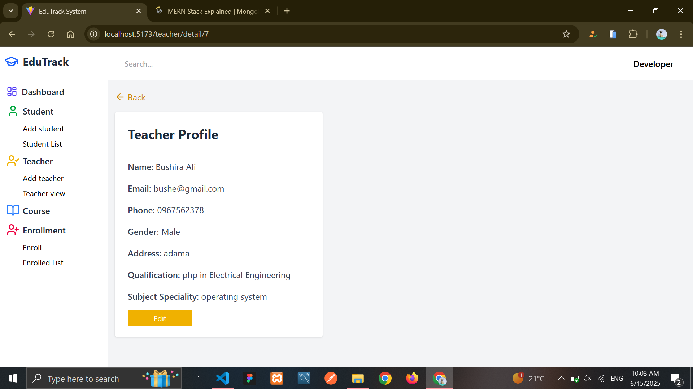

---
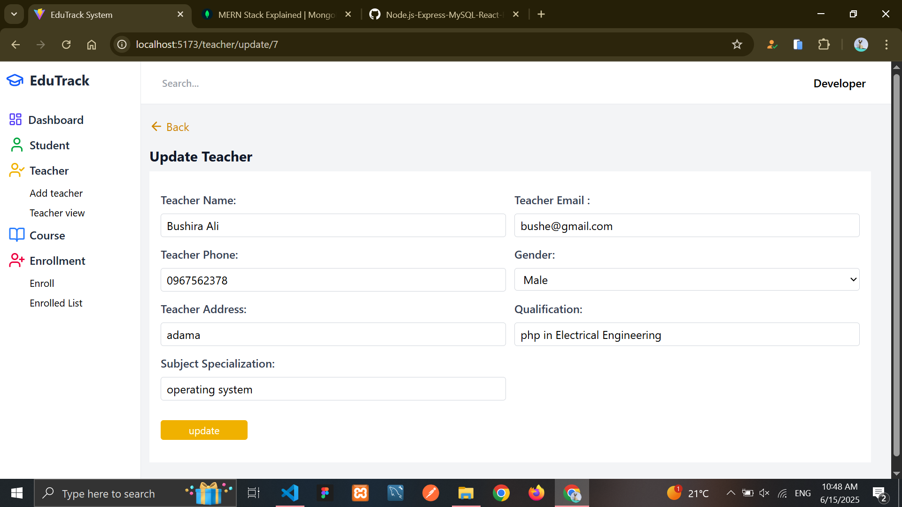

---
---
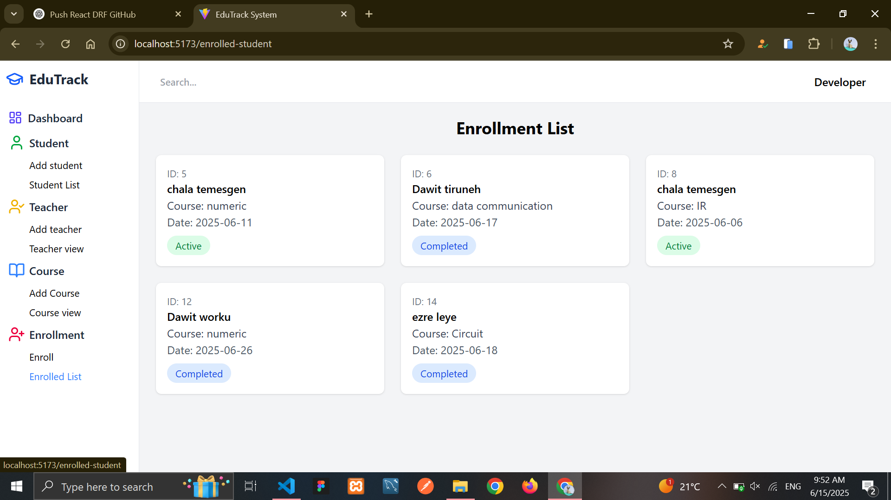

---
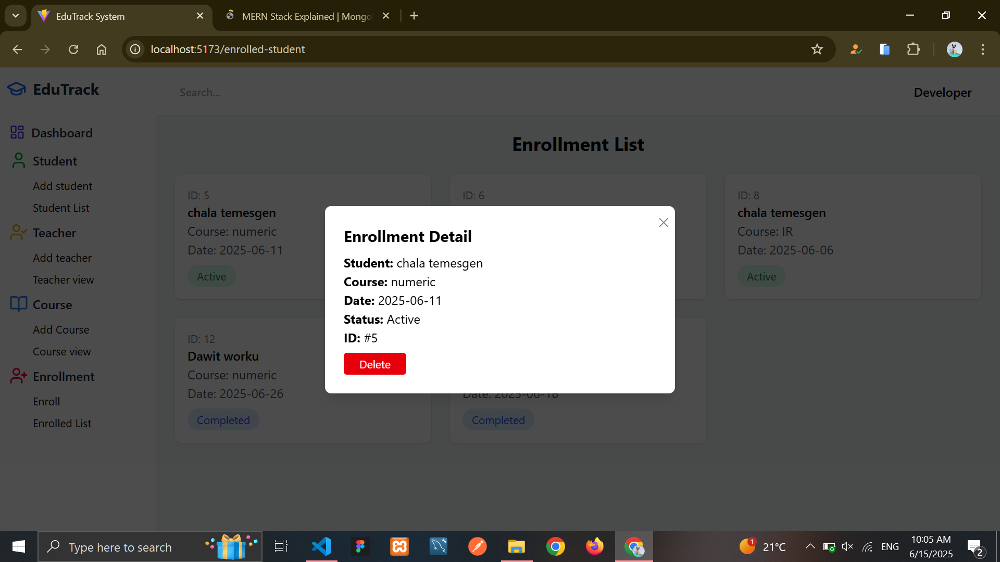

---
---
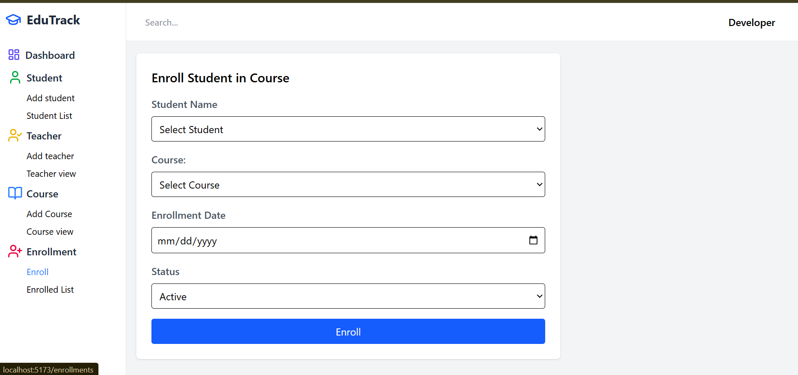

---


## 🛠️ Built With

- **Backend**: Node.js, Express.js
- **Frontend**: React, Tailwind CSS
- **Database**: MySQL
- **Other Tools**: Axios, React Router, Context API

---

## 🧪 How to Run the Project Locally

### 🔧 Backend (Express + MySQL)

1. **Clone the repository**
```bash
git clone https://github.com/daveEasyCoder/edutrack-system.git
cd edutrack-system/backend
